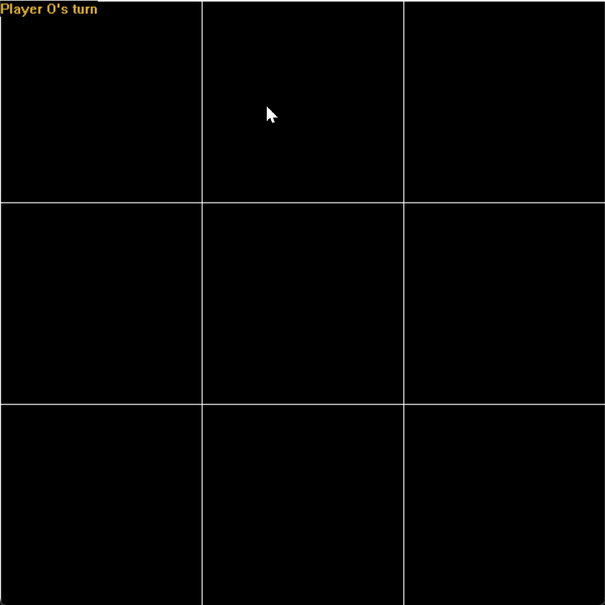

# Tic-Tac-Toe Game

一个基于EasyX图形库开发的井字棋游戏，使用C++编写，具有简洁的图形界面和流畅的游戏体验。

## 🎮 功能特性

- **图形化界面**: 使用EasyX图形库实现美观的游戏界面
- **双人对战**: 支持两名玩家轮流下棋
- **实时提示**: 显示当前轮到哪位玩家
- **胜负判定**: 自动检测胜利条件和平局情况
- **交互友好**: 鼠标点击操作，ESC键退出游戏

## 📸 演示

### 鼠标交互演示


### 井字棋游戏演示



## 🛠️ 环境要求

- **操作系统**: Windows
- **编译器**: Visual Studio 2019+ 或支持C++11的编译器
- **图形库**: EasyX图形库

## 📦 安装说明

### 1. 安装EasyX图形库

1. 访问 [EasyX官网](https://easyx.cn/)
2. 下载并安装最新版本的EasyX图形库
3. 确保编译器能够找到EasyX的头文件和库文件

### 2. 编译项目

#### 使用Visual Studio

1. 打开Visual Studio
2. 创建新的C++项目
3. 将源代码文件添加到项目中
4. 配置项目链接EasyX库
5. 编译运行

#### 使用命令行

```bash
# 确保已安装EasyX并配置好环境变量
g++ -o Tic-Tac-Toe.exe EasyX_Demo/demo2.cpp -leasyx
```

## 🎯 使用方法

### 运行游戏

1. 编译成功后运行 `Tic-Tac-Toe.exe`
2. 游戏窗口会自动打开

### 游戏操作

- **鼠标左键**: 在空白格子中放置棋子
- **ESC键**: 退出游戏

### 游戏规则

- 两名玩家轮流在3x3的棋盘上下棋
- 玩家O使用圆形棋子，玩家X使用叉形棋子
- 率先在横向、纵向或对角线上连成三子的玩家获胜
- 如果棋盘填满且无人获胜，则为平局

## 📁 项目结构

```
Tic-Tac-Toe/
├── EasyX_Demo/          # 源代码目录
│   ├── demo1.cpp        # 鼠标交互演示程序
│   └── demo2.cpp        # 井字棋游戏主程序
├── Demo_Vedio/          # 演示视频目录
│   ├── demo1.gif        # 鼠标交互演示
│   └── demo2-Tic-Tac-Toe.gif  # 井字棋游戏演示
├── exe/                 # 可执行文件目录（已忽略）
├── README.md           # 项目说明文档
└── .gitignore          # Git忽略文件配置
```

## 🚀 快速开始

1. **克隆仓库**

   ```bash
   git clone https://github.com/your-username/Tic-Tac-Toe.git
   cd Tic-Tac-Toe
   ```
2. **编译运行**

   ```bash
   # 使用Visual Studio打开项目并编译
   # 或使用命令行编译
   g++ -o Tic-Tac-Toe.exe EasyX_Demo/demo2.cpp -leasyx
   ```
3. **开始游戏**

   ```bash
   ./Tic-Tac-Toe.exe
   ```

## 📝 开发说明

### 主要文件说明

- `demo1.cpp`: 简单的鼠标交互演示，展示EasyX的基本图形功能
- `demo2.cpp`: 完整的井字棋游戏实现，包含游戏逻辑和界面绘制

### 核心功能

- **游戏状态管理**: 使用二维向量存储棋盘状态
- **胜负判定**: 检查行、列、对角线是否连成三子
- **玩家切换**: 自动在两名玩家之间切换
- **图形绘制**: 绘制棋盘网格和棋子

## 🤝 贡献指南

欢迎提交Issue和Pull Request来改进这个项目！

1. Fork本仓库
2. 创建特性分支 (`git checkout -b feature/AmazingFeature`)
3. 提交更改 (`git commit -m 'Add some AmazingFeature'`)
4. 推送到分支 (`git push origin feature/AmazingFeature`)
5. 打开Pull Request

## 📄 许可证

本项目采用MIT许可证 - 查看 [LICENSE](LICENSE) 文件了解详情
